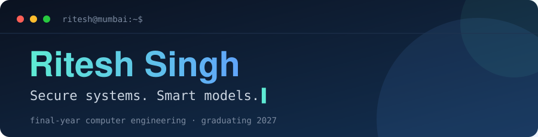

```bash
$ whoami
ritesh — computer engineering student, mumbai

$ cat focus.txt
secure-by-design systems · models that explain their decisions

$ status
open to work → Software Engineer (Java / Spring Boot) · graduating 2027
```

<br>

<div align="center">


<br><br>

🥈 **1st Runner-Up** · National Level Hackathon, Raigad &nbsp;&nbsp;|&nbsp;&nbsp; 🏅 **Finalist** · Smart India Hackathon &nbsp;&nbsp;|&nbsp;&nbsp; 🏅 **Finalist** · IIITM Gwalior Hackathon

<br>

[](https://www.linkedin.com/in/ritesh-singh-65a8692a6)


</div>
